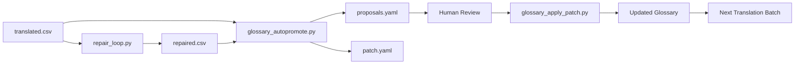

# Glossary Autopromote Workflow

This workflow extracts term candidates from production evidence (repair diffs, soft QA issues) and generates proposals for human review.

## Overview

The autopromote flywheel does three things:
1. **Extract** term candidates from before/after diffs and terminology issues
2. **Aggregate** by (term_zh, term_ru), detect conflicts with existing approved terms
3. **Output** proposals + patch for human review (never auto-approve)

## Glossary Directory Structure

```
glossary/
├── global.yaml                    # Universal terms (all languages)
└── zhCN_ruRU/
    ├── base.yaml                  # Core game terms
    ├── genre_card.yaml            # Card game specific
    ├── ip_naruto.yaml             # Naruto IP terms
    └── project_naruto_mobile_v1.yaml  # Project specific
```

## Entry Format

```yaml
entries:
  - term_zh: "木叶"
    term_ru: "Коноха"
    status: "approved"       # approved | proposed | rejected
    tags: ["ip", "location"]
    confidence: 0.99
    evidence:
      - type: "manual"
        note: "已与官方译名对齐"
```

## Run Autopromote

### Basic Usage

```bash
python scripts/glossary_autopromote.py \
  --before data/translated.csv \
  --after data/repaired.csv \
  --style workflow/style_guide.md \
  --glossary glossary/zhCN_ruRU/base.yaml \
  --language_pair "zh-CN->ru-RU" \
  --scope "project_default"
```

### With Soft QA Tasks

```bash
python scripts/glossary_autopromote.py \
  --before data/translated.csv \
  --after data/repaired.csv \
  --style workflow/style_guide.md \
  --glossary glossary/zhCN_ruRU/base.yaml \
  --soft_tasks data/repair_tasks.jsonl \
  --language_pair "zh-CN->ru-RU" \
  --scope "ip_naruto" \
  --min_support 3 \
  --out_proposals data/glossary_proposals.yaml \
  --out_patch data/glossary_patch.yaml
```

### Parameters

| Parameter | Default | Description |
|-----------|---------|-------------|
| --before | required | Before CSV (translated.csv) |
| --after | required | After CSV (repaired.csv) |
| --style | required | Style guide markdown |
| --glossary | required | Existing glossary YAML |
| --soft_tasks | None | Soft QA tasks JSONL |
| --language_pair | zh-CN->ru-RU | Language pair |
| --scope | project_default | Scope tag |
| --min_support | 5 | Min occurrences to propose |
| --max_rows | 500 | Max rows to process |

## Outputs

### glossary_proposals.yaml

Human-readable proposals with evidence:

```yaml
meta:
  version: 1
  language_pair: "zh-CN->ru-RU"
  scope: "ip_naruto"
  min_support: 5
proposals:
  - term_zh: "忍术"
    term_ru: "Ниндзюцу"
    status: "proposed"
    confidence: 0.92
    support: 12
    evidence:
      examples:
        - string_id: "skill_001"
          before_ru: "Техника"
          after_ru: "Ниндзюцу"
```

### glossary_patch.yaml

Machine-applicable patch:

```yaml
op: "append_entries"
target_glossary: "glossary/zhCN_ruRU/base.yaml"
entries:
  - term_zh: "忍术"
    term_ru: "Ниндзюцу"
    status: "proposed"
    confidence: 0.92
    notes: "autopromote support=12 scope=ip_naruto"
```

## Review Process

1. **Review proposals** in `data/glossary_proposals.yaml`
2. **Edit patch** if needed:
   - Change `status` to `approved` for confirmed terms
   - Remove entries you don't want to add
3. **Apply patch**:

```bash
python scripts/glossary_apply_patch.py \
  --patch data/glossary_patch.yaml \
  --backup
```

## Conflict Handling

- If a proposed term_zh already has an `approved` term_ru that differs, it's flagged as a conflict
- Conflicts are NOT included in proposals (require manual review)
- To override an approved term, update the glossary directly

## Integration with Workflow


