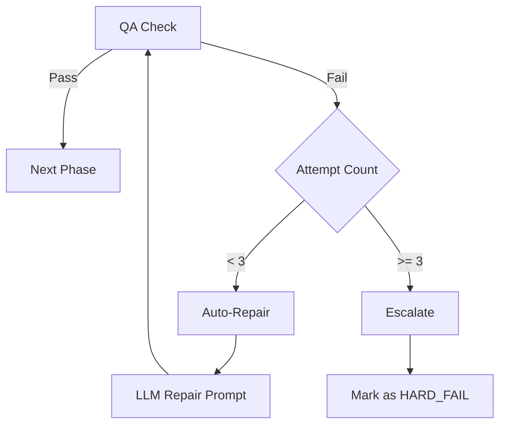

# Hard QA Rules & Repair Logic

## Overview

This document defines the Hard Quality Assurance (QA) standards for the localization pipeline. It details the validation rules that enforce technical correctness and the automated repair strategies used to fix violations.

## 1. Hard QA Rules (7 Categories)

The following rules must be satisfied for a translation to be considered technically valid.

| Rule ID | Category | Description | Positive Example (Pass) | Negative Example (Fail) |
| :--- | :--- | :--- | :--- | :--- |
| **R1** | Placeholder Mismatch | All tokens in source must exist in target. | `src: PH_1 word<br>tgt: PH_1 слово` | `src: PH_1 word<br>tgt: слово` |
| **R2** | Forbidden Patterns | Target must not contain blocked terms/syntax. | `No, thank you.` | `Non, merci. (French leak)` |
| **R3** | Tag Balance | XML/HTML tags must be paired correctly. | `<b>Bold</b>` | `<b>Bold</i>` |
| **R4** | Empty Translation | Target must not be empty or whitespace. | `Action` | ` ` |
| **R5** | Numerical Mismatch | Numbers in source generally match target. | `Level 5` | `Level 50` |
| **R6** | Length Limit | Target length must satisfy context limits. | `OK (2 chars)` | `Confirmer (Too long)` |
| **R7** | Leading/Trailing | Preserves whitespace/punctuation symmetry. | `[Space]Text` | `Text` |

## 2. Repair Loop Logic

The system uses a decision tree to handle QA failures:



- **Auto-Repair**: Uses `gpt-4o` (or configured model) with specific error context to fix the line.
- **Escalate**: After 3 failed attempts, the row is marked `has_error=true` in the report and requires manual intervention.
- **Scope**: Repairs only modify the `target_text`; source and Context are immutable.

## 3. Typical Command Sequence

### Step 1: Run QA Check

Generates a report detailing all violations.

```bash
python scripts/qa_hard.py output/translated.csv output/placeholder_map.json --out_report output/qa_report.json
```

### Step 2: Run Repair Loop

Attempts to fix reported errors.

```bash
python scripts/repair_loop.py --input output/translated.csv --report output/qa_report.json --mode repair_hard --out_csv output/repaired_v1.csv
```

## Quick Commands

```bash
# Check single file validation
python scripts/qa_hard.py data/target.csv data/map.json

# Run repair with debug output
set LLM_DEBUG=1
python scripts/repair_loop.py --input data/target.csv --report data/report.json --mode repair_hard
```

## Common Pitfalls

- **Trap 1**: **Ignoring Report**.
  - **Consequence**: Broken placeholders in final game build (`PH_1` visible to users).
  - **Fix**: Always check `qa_report.json` for `has_errors: true` before exporting.
- **Trap 2**: **Circular Repairs**.
  - **Consequence**: Repair loop toggles between two invalid states (e.g. adding/removing space).
  - **Fix**: Check `repair_history.json` for oscillating patterns; fix glossary manually.
