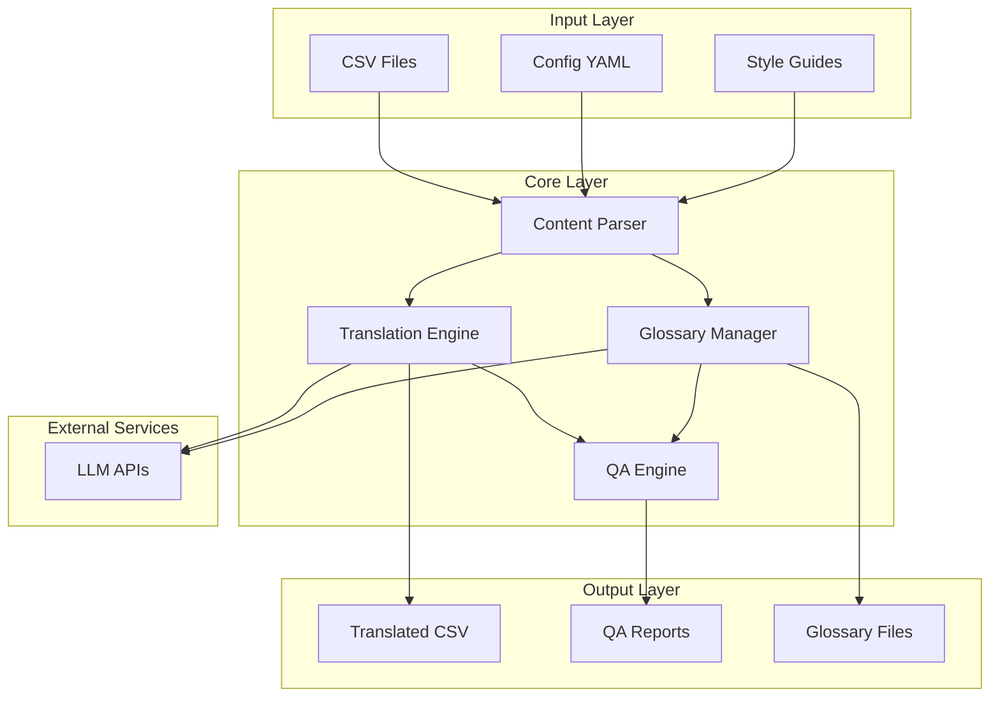
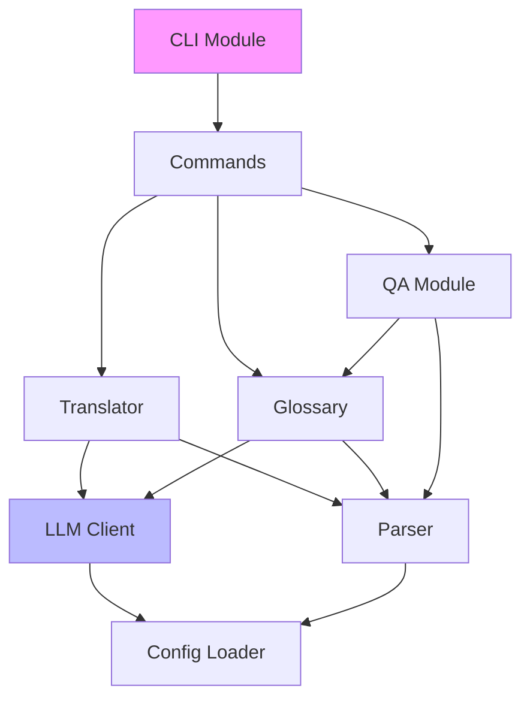
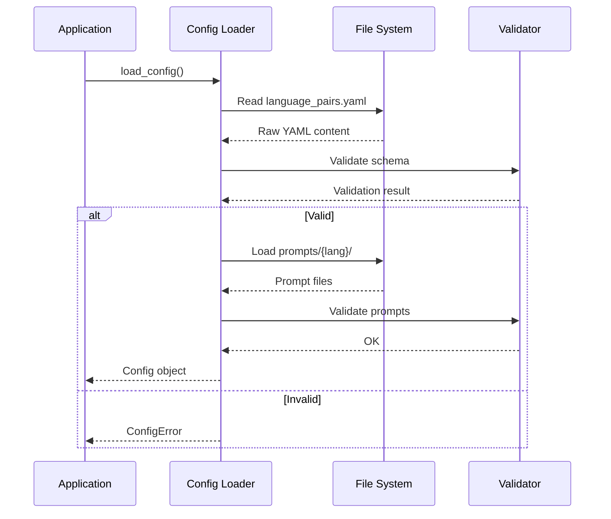

# Loc-MVR Architecture

## System Overview

Loc-MVR is a game localization system designed for batch translation, glossary management, and quality assurance of game content.

## System Architecture



## Data Flow

### 1. Translation Flow

```
┌─────────────┐    ┌──────────────┐    ┌─────────────┐    ┌──────────────┐
│  Input CSV  │───▶│   Parser     │───▶│  Translator │───▶│  LLM API     │
└─────────────┘    └──────────────┘    └─────────────┘    └──────────────┘
                                              │                      │
                                              ▼                      ▼
                                       ┌─────────────┐    ┌──────────────┐
                                       │  Glossary   │◄───│  Translation │
                                       └─────────────┘    └──────────────┘
                                              │
                                              ▼
                                       ┌─────────────┐
                                       │ Output CSV  │
                                       └─────────────┘
```

**Process:**
1. **Parse**: Read and validate input CSV
2. **Extract**: Identify translatable content and context
3. **Glossary Lookup**: Check for known terms
4. **Translate**: Send to LLM with context and glossary
5. **Post-process**: Apply consistency rules
6. **Output**: Write translated content

### 2. QA Flow

```
┌────────────────┐    ┌──────────────┐    ┌──────────────┐
│ Translated CSV │───▶│  QA Engine   │───▶│  Style Check │
└────────────────┘    └──────────────┘    └──────────────┘
                               │                      │
                               ▼                      ▼
                        ┌──────────────┐    ┌──────────────┐
                        │ Glossary Check│    │ Grammar Check│
                        └──────────────┘    └──────────────┘
                               │                      │
                               ▼                      ▼
                        ┌──────────────────────────────────┐
                        │          QA Report                │
                        └──────────────────────────────────┘
```

## Module Dependencies



| Module | Dependencies | Description |
|--------|--------------|-------------|
| `cli` | commands | Entry point and argument parsing |
| `commands` | translator, glossary, qa | Command implementations |
| `translator` | parser, llm_client | Translation orchestration |
| `glossary` | parser, llm_client | Glossary management |
| `qa` | parser, glossary | Quality assurance |
| `parser` | config_loader | Content parsing |
| `llm_client` | config_loader | LLM API interactions |
| `config_loader` | - | Configuration management |

## Configuration Loading Flow



**Configuration Priority:**
1. Environment variables (highest)
2. User config file (`~/.config/loc-mvr/config.yaml`)
3. Project config (`./config/`)
4. Default values (lowest)

## Component Details

### Content Parser
- Parses CSV, Excel, and JSON formats
- Extracts translatable strings and context
- Handles game-specific formats (Unity, Unreal)

### Translation Engine
- Manages batch processing
- Implements retry logic and rate limiting
- Handles context preservation

### Glossary Manager
- Term extraction and matching
- Translation memory integration
- Consistency enforcement

### QA Engine
- Style guide compliance
- Terminology consistency
- Grammar and formatting checks

## Scalability Considerations

- **Batch Processing**: Configurable batch sizes
- **Parallel Processing**: Multi-threading support for large datasets
- **Caching**: Translation memory and glossary caching
- **Rate Limiting**: Respects LLM API limits
